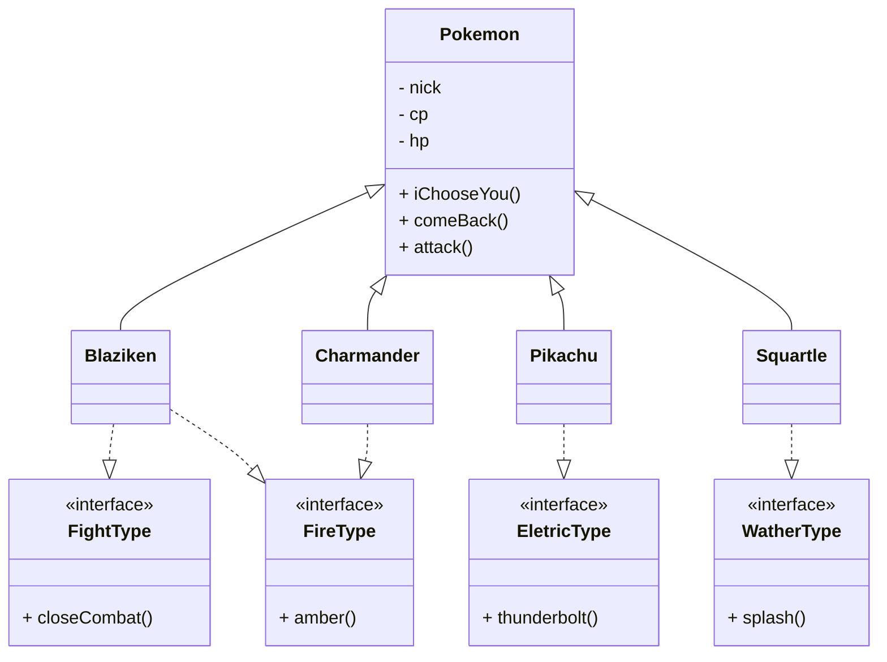
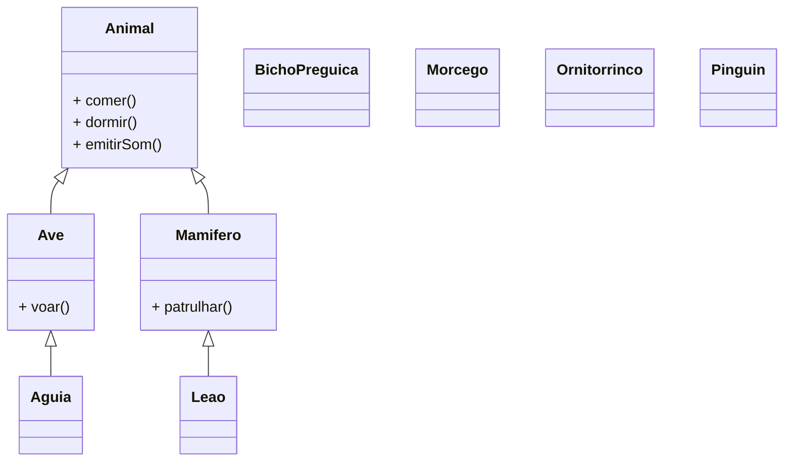

# Desafio de Programação Orientada a Objetos

## Objetivo

Implemente, em Java, os dois modelos apresentados neste documento. A atividade tem como objetivo praticar os principais conceitos de Programação Orientada a Objetos (POO):

- abstração e encapsulamento;
- herança e sobrescrita de métodos;
- classes abstratas;
- interfaces;
- polimorfismo.

Não se limite a criar classes vazias. Os métodos devem apresentar comportamentos coerentes com cada personagem ou animal, e a aplicação deve demonstrar o funcionamento das implementações.

## Parte 1 — Pokémon

Implemente a hierarquia representada pelo diagrama a seguir.

### Requisitos

1. Implemente os métodos comuns `iChooseYou()`, `comeBack()` e `attack()`.
2. Crie as classes concretas `Blaziken` e `Squartle` usando herança.
3. Crie as interfaces de tipo e implemente-as nas classes indicadas pelo diagrama.
4. Sobrescreva comportamentos quando necessário para representar as particularidades de cada Pokémon.
5. Em uma classe executável, instancie os Pokémon e demonstre tanto os comportamentos herdados quanto os definidos pelas interfaces.

> **Observação:** os nomes do diagrama foram mantidos para corresponder ao material-base. Caso decida corrigir nomes em inglês, como `WatherType`, `EletricType`, `Squartle` ou `amber`, faça a alteração de maneira consistente em todas as classes, interfaces e referências.

## Parte 2 — Animais

Complete e implemente o modelo abaixo. Além de reproduzir as relações já apresentadas, identifique a classificação mais adequada para os animais que ainda não estão conectados no diagrama.

### Requisitos

1. Modele `Animal`, `Ave` e `Mamifero`, escolhendo justificadamente quais delas devem ser abstratas.
2. Implemente os comportamentos comuns `comer()`, `dormir()` e `emitirSom()`.
3. Implemente `voar()` em `Ave` e `patrulhar()` em `Mamifero`, considerando que nem toda ave voa e que os comportamentos podem variar entre espécies.
4. Crie as classes `Leao`, `Aguia`, `BichoPreguica`, `Morcego`, `Ornitorrinco` e `Pinguin`.
5. Complete as relações de herança ausentes no diagrama.
6. Use interfaces quando um comportamento puder ser compartilhado por classes de hierarquias diferentes. Um exemplo importante é a capacidade de voar, presente em uma ave e também em um mamífero.
7. Crie uma demonstração polimórfica usando uma coleção de animais e invoque seus comportamentos sem depender diretamente das classes concretas.

> Resolva os problemas de modelagem de forma coerente, justificando suas escolhas de abstração, herança e interfaces.
> Atente-se ao Ornitorrinco, que é um mamífero que põe ovos e possui características de aves. O Pinguim é uma ave que não voa, mas nada muito bem. O Morcego é um mamífero que voa. O Bicho Preguiça é um mamífero que se move lentamente e passa a maior parte do tempo em árvores.

## Critérios de conclusão

A atividade será considerada completa quando:

- o projeto compilar e executar sem erros;
- todas as classes e interfaces dos diagramas estiverem implementadas;
- os atributos estiverem encapsulados;
- herança, interfaces, sobrescrita e polimorfismo forem usados de forma coerente;
- houver uma classe executável que demonstre os comportamentos solicitados;
- o código estiver organizado, legível e sem duplicações desnecessárias.

## Entrega

Envie o código-fonte completo. Inclua também uma breve explicação das principais decisões de modelagem, especialmente:

- quais classes foram definidas como abstratas e por quê;
- quais comportamentos foram representados por interfaces;
- como o polimorfismo foi demonstrado na aplicação.
